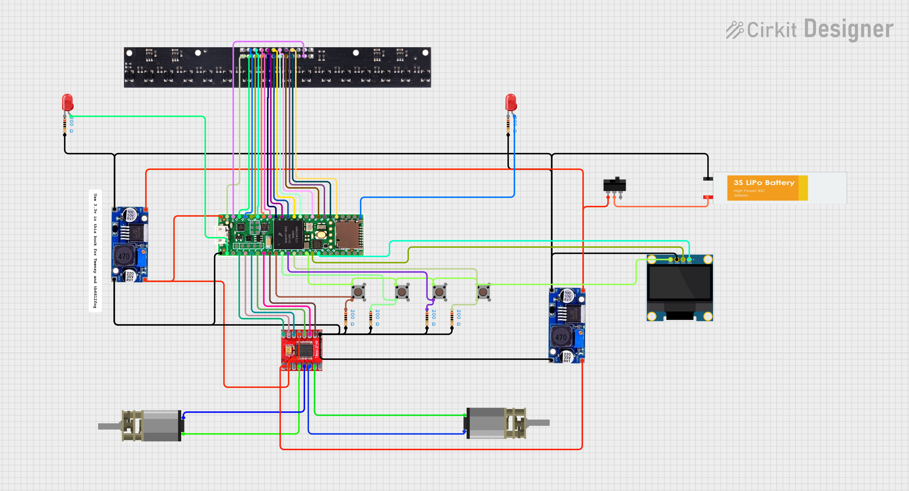

# ⚡Meshmerize 2024 (IIT Bombay Techfest)

  
   
  <i>Our entry for the Meshmerize Grid Solving Challenge at Techfest, IIT Bombay</i>

## 📖 Overview

This bot was designed and built to compete in **Meshmerize**, a robotics challenge at IIT Bombay Techfest. The problem statement required the bot to autonomously navigate a grid/maze based on line-following principles, detect nodes, and traverse the shortest path to the destination.

This project utilizes the high processing power of the **Teensy 4.1** to handle high-speed PID loops and complex maze-solving algorithms efficiently.

### 🌟 Key Features
* **Processor:** Teensy 4.1 (ARM Cortex-M7 running at 600 MHz) for ultra-fast loop times.
* **Sensor Array:** QTR-16 RC sensor array for precise line position error calculation.
* **Control Algorithm:** PID (Proportional-Integral-Derivative) loop for smooth line following.
* **Maze Solving:** Flexible options for Left first or Right first algorithm to handle grid intersections.

---

## ⚡ Electronics & Circuitry

The robot uses a modular wiring approach with a perf-board setup for easy debugging.

### 🔌 Circuit Diagram
The connections between the Teensy, motor driver, and sensors are detailed below.

<b>Click to collapse Circuit Diagram</b>

 

### 🛠 Bill of Materials

| Component | Model/Type | Function |
| :--- | :--- | :--- |
| **Microcontroller** | **Teensy 4.1** | 600 MHz Brain of the bot |
| **Motor Driver** | TB6612FNG | Controls motor speed/direction |
| **Line Sensor** | QTR-16 RC | Detects white line on black surface |
| **Motors** | N20 Micro Gear Motors | Drive system |
| **Power** | 3S LiPo Battery | Power supply |

---

## 🧠 Code & Logic

The firmware handles real-time sensor reading and motor control.

### 📂 Logic Flow
1.  **Calibration:** On startup, the bot spins to calibrate sensor min/max values.
2.  **PID Loop:** Calculates error based on sensor position and adjusts motor PWM.
    * `Error = Desired_Position - Actual_Position`
    * `Correction = Kp*Error + Kd*Change_In_Error + Ki*Sum_Error`
3.  **Node Detection:** Monitors specific sensor patterns (e.g., all sensors HIGH) to identify intersections.
4.  **Decision Making:** Uses [Left-Hand Rule / LSRB Algorithm] to navigate nodes.

---

## 🚀 How to Run

1.  **Dependencies:** * Install the [Arduino IDE](https://www.arduino.cc/en/software).
    * Install **Teensyduino** (Teensy Loader application).
2.  **Libraries:** You may need the following libraries:
    * `QTRSensors.h` (if using Pololu sensors)
3.  **Setup:**
    * Open `Tools` > `Board` and select **Teensy 4.1**.
    * Set CPU Speed to **600 MHz**.
4.  **Upload:**
    * Connect the Teensy via Micro-USB.
    * Click Upload (The Teensy Loader window should appear).

---

## 👥 Contributors

* **Atharva Yadav**
* **Akul Kute**
* **Aishwarya Soman**

---

## 📄 License

This project is open source.
